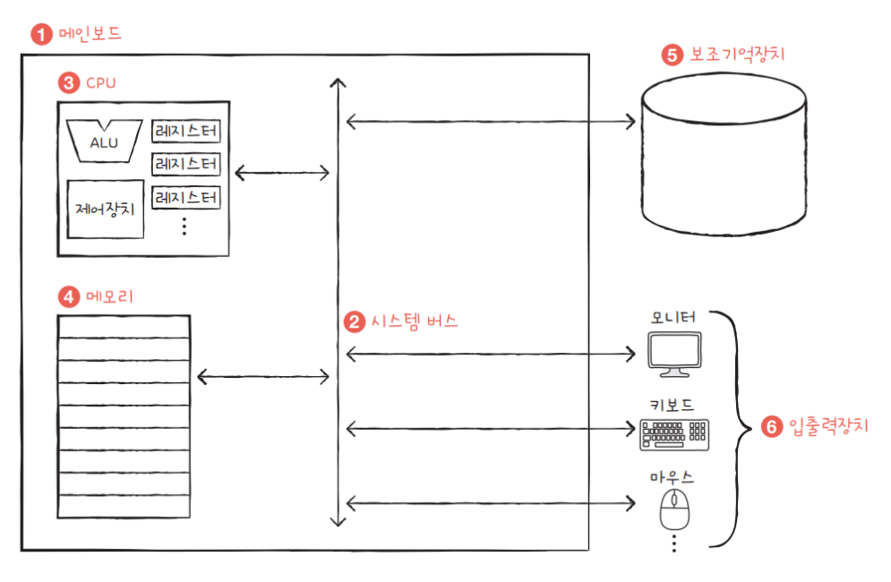
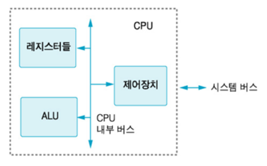
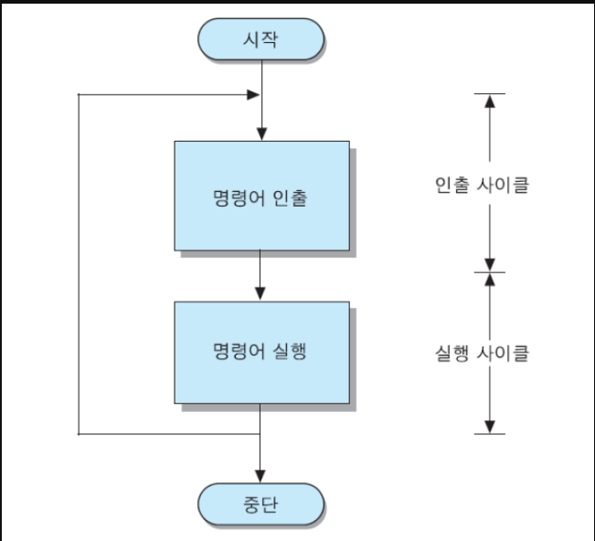
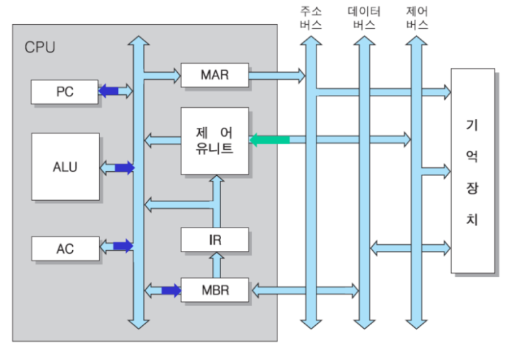
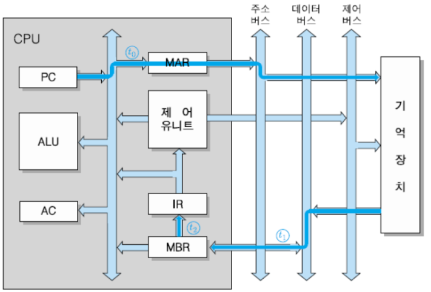
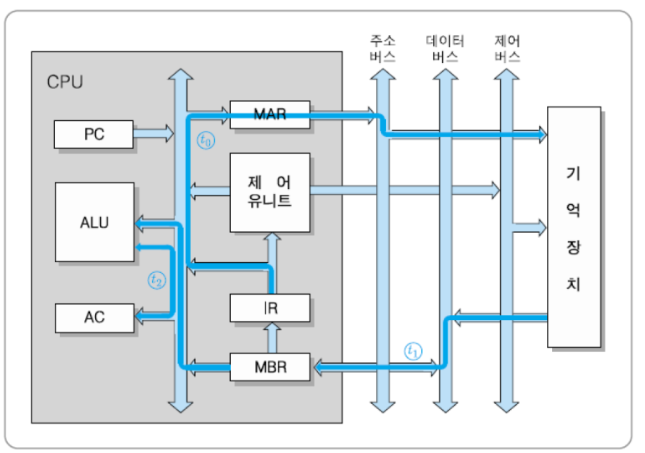
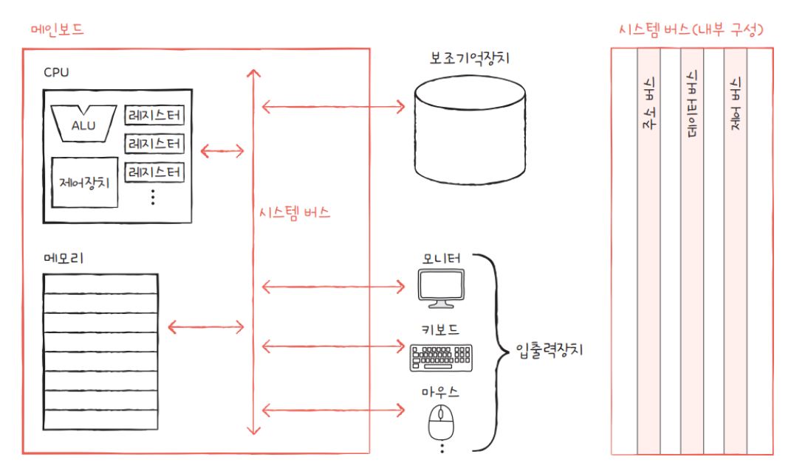

# 컴퓨터의 구성
> 컴퓨터 = 하드웨어 + 소프트웨어  
# 소프트웨어
> 하드웨어의 동작을 지시하고 제어하는 명령어의 집합
## 시스템 소프트웨어
> 시스템 리소스를 관리하고 응용 프로그램 소프트웨어를 실행할 수 있는 플랫폼을 제공한다.
* 저수준 언어, 즉 어셈블리 언어로 작성된다.
* 시스템이 켜지면 실행되고 종료될 때 까지 실행된다.
* 시스템 소프트웨어 없이는 시스템을 실행할 수 없다.
* ex ) 운영체제
* 일반적으로 End User(사용자)들은 시스템 소프트웨어와 직접 소통하지 않는다. 시스템 소프트웨어에서 만든 GUI와 상호작용을 한다.   
## 응용 소프트웨어
> 사용자들이 필요한 특정 작업들을 수행하기 위해 설계된 프로그램.         
* 개발자들이 만들어낸 프로그램들이라고 보면 된다.
* 고급 언어 (Java, C#, C 등)로 작성된다.
* 사용자가 요청할 때 실행된다. 
* ex ) Microsoft Office, Internet Explorer, Photoshop, 계산기 등

---  

# 하드웨어 : 컴퓨터를 구성하는 기계적 장치

## 중앙처리 장치 (CPU : Computer Processing Unit)
> 프로그램이 돌면 메모리에 명령어들이 올라간다. 그러면 해당 명령어를 해석해서 연삭 후 결과를 출력하는 작업을 담당한다.  
* 이때 명령어를 가져오는 것을 **fetch**라고 하는데, **시스템 버스**를 타고 가져온다.  
## CPU의 구조
    1. ALU (Arithmetic Logical Unit) : 산술/논술 연산을 수행하는 회로
    - 산술 : +,-,* 등의 연산
    - 논리 : and, or, xor 등의 연산
    2. 레지스터(Register) : 고성능의 CPU 안에 있는 메모리의 일종이다. 데이터를 저장할 수 있음. 
        * CPU 전용 임시기억장치!
        * Address 를 저장한다.
    3. 제어장치(CU : Control Unit) : 프로그램 코드(명령어)를 해석하고 실행하기 위한 제어 신호(control signal)들을 발생하는 하드웨어 모듈이다.

## CPU의 명령 수행 과정 (명령어 사이클 Instruction Cycle) 

            
    * 명령어 인출, 명령어 해독, 데이터 인출, 데이터 처리, 데이터 저장 총 5계의 단계가 있고 2가지의 사이클로 나누어진다.  

    1. 인출 사이클 (Fetch Cycle) : CPU가 주 기억장치로부터 명령어를 읽어오는 단계
    2. 실행 사이클 (Execution Cycle) : 명령어를 실행하는 단계로 명령어를 해독하고, 데이터를 인출해서 처리하고 저장 하는 과정이다.
    * 이러한 과정이 컴퓨터가 종료되거나 오류가 나서 중단될 때까지 무한 반복됩니다.  

### 명령어 실행에 필요한 레지스터들

            
    * 프로그램 카운저 (PC : Program Counter) : 다음에 인출할 명령어의 주소를 가지고 있는 레지스터.       
    * 누산기 (AC : Accumulator) : 데이터를 일시적으로 저장하는 레지스터. 길이는 CPU가 한번에 처리할 수 있는 데이터 비트 수와 동일하다.
    * 명령어 레지스터 (IR : Instruction Register) : 가장 최근에 인출된 명령어 코드가 저장되는 레지스터
    * 기억장치 주소 레지스터 (MAR : Memory Adress Register) : PC에 저장된 명령어 주소가 시스템 주소 버스로 출력되기 전에 일시적으로 저장되는 주소 레지스터. 시스템 주소 버스와 직접적으로 연결된 인터페이스라고도 볼 수 있다. 
    * 기억장치 버퍼 레지스터 (MBR : Memory Buffer Register) : 기억장치에 쓰거나 읽어온 데이터나 명령어를 일시적으로 저장하는 버퍼 레지스터
    * AC (Accumulator)  : 데이터를 잠시 저장하는 임시 메모리
***
### 인출 사이클  

            
    1. t0 : MAR <- PC
        PC에 있는 다음에 인출할 명령어 주소를 MAR을 통해서 메모리에 전달한다.
    2. t1 : MBR <- M[MAR], PC <- PC + 1(word)
        해당 주소에 있는 명령어가 데이터 버스를 타고 MBR에 저장된다. 
    3. t2 : IR <- MBR
        MBR에 있는 명령어가 IR로 이동된다. 
***
### 실행 사이클

    * IR의 데이터를 저장할 기억장치의 주소를 MAR로 보내고 이를 통해 기억장치로 주소를 보낸다.
    그리고 저장할 데이터를 MBR로 옮기고, AC에 저장된 값고 MBR의 값을 ALU(산술논리연산장치)로 보낸다.
    ALU에서 연산이 진행되고 그 결과값이 AC에 저장된다.

    ** 자세한 과정
    1. 데이터의 이동 : 기억장치에 저장되어있는 데이터를 CPU 내부 레지스터인 AC로 이동하는 명령어
        * t0 : MAR <- IR (addr)
            - 명령어 레지스터 IR에 있는 명령어의 주소부분을 MAR로 전송한다.
        * t1 : MBR <- M[MAR]
            - 그 주소가 지정한 기억장소로부터 데이터를 인출하여 MBR로 전송한다.
        * t2 : AC <- MBR
            - 해당 데이터를 AC에 적재한다.
    2. 데이터의 저장
        * t0 : MAR <- IR (addr)
            -데이터를 저장할 기억장치의 주소를 MAR로 전송한다.
        * t1 : MBR <- AC
            - 저장할 데이터를 버퍼 레지스터인 MBR로 이동한다.
        * t2 : M[MAR] <- MBR
            - MBR의 내용을 MAR이 지정하는 기억장소에 저장한다.
    3. 데이터의 처리 : 기억장치에 저장된 데이터를 AC의 내용과 더하고, 그 결과를 다시 AC에 저장한다.
        * t0 : MAR <- IR (addr)
            - 데이터를 저장할 기억장치의 주소를 MAR로 전송한다.
        * t1 : MBR <- M[MAR]
            - 저장할 데이터를 버퍼 레지스터인 MBR로 이동한다.
        * t2 : AC <- AC + MBR
            - 그 데이터와 AC의 내용을 더하고 결과값을 다시 AC에 저장한다.
***
***
## 기억장치(RAM, HDD) : 프로그램, 데이터, 연산의 중간 결과를 저장하는 장치
    1. 주 기억장치 : 크게 RAM과 ROM 두가지가 있다. 메모리는 보통 RAM을 지칭한다.
    2. 보조기억장치
## 메모리 
> 현재 실행되는 프로그램의 명령어와 데이터를 저장하는 부품. 

        1. 주소 (Address) : 주소로 메모리 내에 있는 원하는 위치에 접근할 수 있다. 
        2. 프로그램이 실행되기 위해서는 반드시 메모리에 저장되어 있어야 한다.
## 보조기억장치
> 메모리보다 크기가 크고 전원이 꺼져도 저장된 내용을 잃지 않는 메모리를 보조할 저장 장치

        ex) 하드 디스크, SSD, USB 메모리, DBD, CD 등
## 메모리는 **현재 실행되고 있는 프로그램**을 저장한다면 보조기억장치는 **보관할 프로그램**을 저장한다.      
*** 
***
## 입출력장치
    - 마우스, 프린터 -> 너무 쉬우니까 생략하겠습니다,,,,,
*** 
***
## 시스템 버스 
>   CPU, 메모리, 보조기억장치, 입출력 장치 등은 모두 메인보드에 연결되어 있다. 이 메인보드에 연결된 부품들은 서로 정보를 주고받을 수 있는데 이때 사용되는 버스라는 것이 있다. 이러한 여러가지 버스들 가운데 네가지 핵심 부품을 연결하는 가장 중요한 버스가 바로 **시스템 버스**다.

    1. 주소 버스
    2. 데이터 버스 : 데이터와 명령어를 주고 받는 통로
    3. 제어 버스 : 제어 신호를 주고 받는 통로
    ex) CPU의 작동 예시
    * CPU가 메모리 속 명령어를 읽기 위해서는 제어장치에서 '메모리 읽기' 라는 신호를 보낸다.
    이때 제어 신호만 보내지 않고
        1. 제어버스로 '메모리 읽기'라는 제어 신호 보내기
        2. 주소 버스로 어디에서 읽을지 주소 보내기
        3. 메모리는 데이터 버스로 CPU가 요청한 주소에 있는 내용을 보낸다.
    * 메모리에 저장할 때
        1. CPU는 데이터 버스를 통해 메모리에 저장할 값을
        2. 주소 버스를 통해 저장할 주소를
        3. 제어 버스를 통해 '메모리 쓰기' 라는 제어 신호를 보낸다.

> 참고 사이트들  
    1. https://hongong.hanbit.co.kr/%EC%BB%B4%ED%93%A8%ED%84%B0%EC%9D%98-4%EA%B0%80%EC%A7%80-%ED%95%B5%EC%8B%AC-%EB%B6%80%ED%92%88cpu-%EB%A9%94%EB%AA%A8%EB%A6%AC-%EB%B3%B4%EC%A1%B0%EA%B8%B0%EC%96%B5%EC%9E%A5/  
     2. https://yaneodoo2.tistory.com/entry/%EC%8B%9C%EC%8A%A4%ED%85%9C-%EB%B2%84%EC%8A%A4%EB%9E%80-%EC%96%B4%EB%93%9C%EB%A0%88%EC%8A%A4-%EB%B2%84%EC%8A%A4-%EC%A0%9C%EC%96%B4-%EB%B2%84%EC%8A%A4-%EB%8D%B0%EC%9D%B4%ED%84%B0-%EB%B2%84%EC%8A%A4  
    3. https://velog.io/@fldfls/%EC%8B%9C%EC%8A%A4%ED%85%9C-%EB%B2%84%EC%8A%A4-System-Bus  
    4. https://mk28.tistory.com/15  
    5. https://devraphy.tistory.com/298  
    6. https://mindstation.tistory.com/151#google_vignette  
    7. https://blog.naver.com/PostView.naver?blogId=ben4109&logNo=222284380523  
    8. https://www.youtube.com/watch?v=MYPLRzxbu0k  
    

    